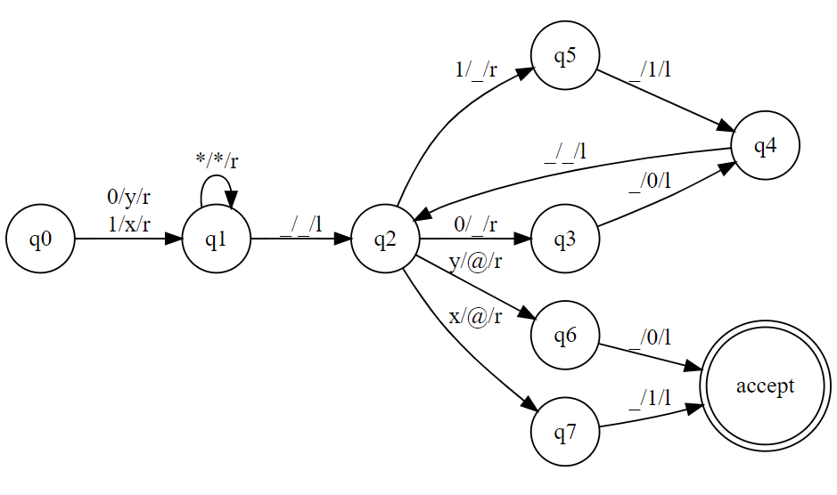
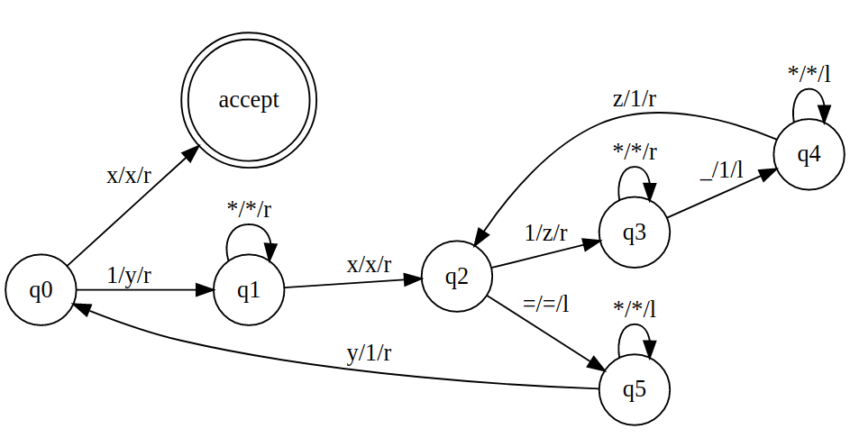
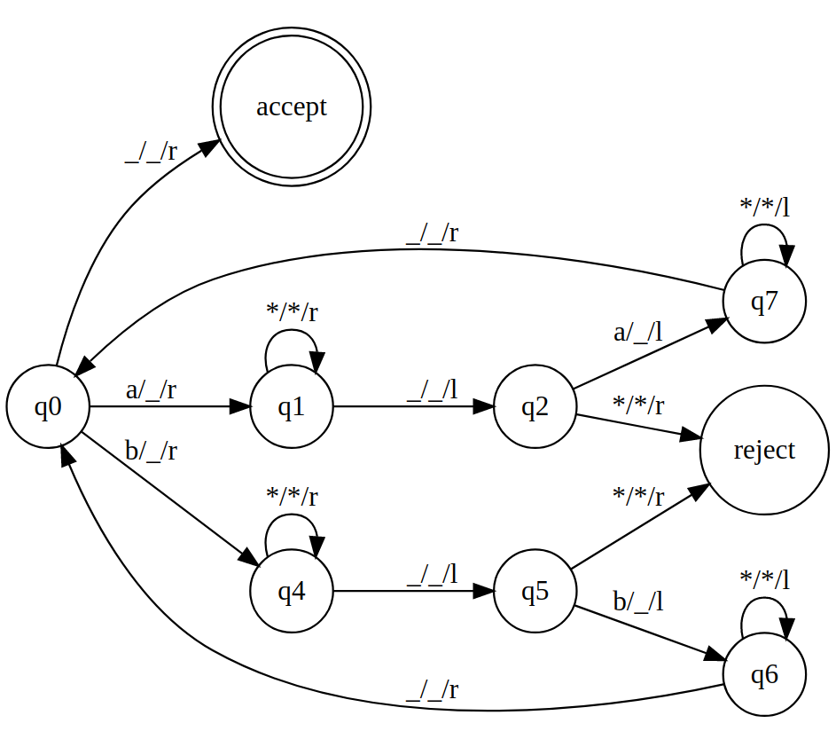
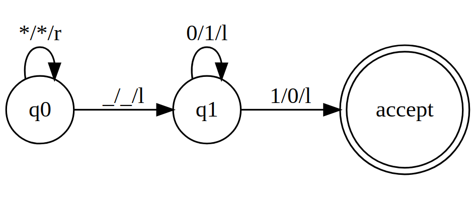

# Trabalho 3 - Máquinas de Turing e Computabilidade

## Linguagens Formais e Autômatos - Bach. Sistemas de Informação
## Autor: Ewerson Vieira Nascimento

### Questão 1

[Código do Simulador Morphett](Questao-01/morphett-questao-01.txt)

### Questão 2

[Código do Simulador Morphett](Questao-02/morphett-questao-02.txt)

### Questão 3

[Código do Simulador Morphett](Questao-03/morphett-questao-03.txt)

### Questão 4

[Código do Simulador Morphett](Questao-04/morphett-questao-04.txt)

### Questão 5

[Código do Simulador Morphett](Questao-05/morphett-questao-05.txt)

### Questão 6

[Código do Simulador Morphett](Questao-06/morphett-questao-06.txt)

### Questão 7

[Código do Simulador Morphett](Questao-07/morphett-questao-07.txt)

### Questão 8

[Código do Simulador Morphett](Questao-08/morphett-questao-08.txt)

### Questão 9

[Código do Simulador Morphett](Questao-09/morphett-questao-09.txt)

### Questão 10

#### Resposta:
É uma máquina de turing que aceita apenas cadeias iniciadas com 0 seguidas de um ou mais 1, produzindo uma cadeia de saída composta somente por 1.

Exemplo:

Entrada|Saída  |
-------|-------|
0      |1
011    |111
0111111|1111111